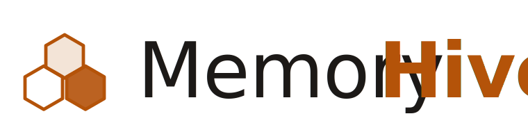

<p align="center">
  <picture>
    <source media="(prefers-color-scheme: dark)" srcset="assets/logo-dark.svg">
    
  </picture>
</p>

<p align="center">
  <em>A shared, continuously learning memory system for multi-agent AI.</em>
</p>

<p align="center">
  <a href="LICENSE"></a>
  <a href="https://github.com/TJCurnutte/memory-hive/actions/workflows/ci.yml"></a>
  <a href="https://github.com/TJCurnutte/memory-hive/releases/latest"></a>
  <a href="INTEGRATION.md"></a>
  
  <a href="https://hive.neural-forge.io"></a>
</p>

<p align="center">
  Multi-agent AI has an amnesia problem. Memory Hive gives every agent a
  private silo and a shared hive so every task compounds instead of
  starting from scratch.
</p>

---

## Start in 2 minutes

Memory Hive should feel simple on day one. You only need one install
command, one way to add an agent, and one way to see the roster.

### 1. Install

```bash
curl -fsSL https://hive.neural-forge.io/install.sh | sh
```

The default install is **zero-input**: no prompts, no account, no
daemon. It creates `~/.memory-hive`, the reserved `main` curator silo,
and managed config blocks for detected agent tools.

### 2. Add only the agents you actually use

```bash
memory-hive add coder --role coder
memory-hive list
```

Each agent gets a private silo:

```text
hive/agents/coder/
├── log.md      # working notes
├── context.md  # role and current focus
└── memory.md   # durable private learnings
```

### 3. Let the hive compound

Agents read the shared hive and their own silo on boot. After useful work,
they write a short log and drop reusable lessons into `hive/learnings/raw/`.
The `main` curator promotes only the useful, verified patterns into shared
knowledge.

That's the loop: **read, work, write back, curate.**

Want the guided setup instead?

```bash
curl -fsSL https://hive.neural-forge.io/install.sh | MEMORY_HIVE_WIZARD=1 sh
# or later:
memory-hive setup
```

Works with **Claude Code, OpenClaw, NanoClaw, Hermes, Cursor, Continue,
Aider, Gemini CLI, Goose, Open Interpreter, Amazon Q, OpenHands, Cline,
Roo Code, Kilo Code, Windsurf, Zed, Warp, Sourcegraph Amp, OpenAI Codex,
OpenCode, Crush, and GitHub Copilot**. See [INTEGRATION.md](INTEGRATION.md)
for the full platform table and opt-out env vars.

---

## Day One

A fresh install should look like this:

1. **Run the installer.** One command creates the hive and wires detected
   agent configs.
2. **Add your first agent.** `memory-hive add coder --role coder` creates
   its private silo and updates the registry.
3. **Check the roster.** `memory-hive list` confirms what exists.
4. **Do real work.** Your agent starts each session by reading the shared
   hive and its silo.
5. **Write back.** Useful task notes go into the agent log; reusable lessons
   go into raw learnings.
6. **Curate later.** `main` reviews raw notes and promotes the few things
   that should become shared truth.

Most users can stop there for weeks.

<details>
<summary>Advanced commands when you are ready</summary>

- **Daily visibility:** `tail`, `query`, `stats`, `digest`
- **Health checks:** `doctor`, `lint`, `checkpoint`, `diff`
- **Built-in optimizer:** `optimize` / `optimizer` for one-pass health + curation + swarm signals
- **Curator workflow:** `dedup`, `confidence`, `promote`, `conflicts`, `stale`, `curate`
- **Agent lifecycle:** `rename`, `archive`, `role`, `register`, `apply`, `seed`

Run `memory-hive help` for the full reference. These commands are useful,
but they are not required to understand the product.

</details>

---

## The Shape of a Hive

```
             ┌─────────────────────────────────────────┐
             │             SHARED HIVE                 │
             │                                         │
             │  registry/     knowledge/               │
             │  learnings/    tasks/                   │
             │                                         │
             │       curator promotes raw → distilled  │
             └───────▲─────────────────────▲───────────┘
             reads   │                     │  reads
             writes  │                     │  writes raw/
                     │                     │
         ┌───────────┴──────┐      ┌───────┴─────────┐
         │     main         │      │     agent       │   ...N
         │  (curator, one)  │      │  (you defined)  │
         ├──────────────────┤      ├─────────────────┤
         │ log.md           │      │ log.md          │
         │ context.md       │      │ context.md      │
         │ memory.md        │      │ memory.md       │
         └──────────────────┘      └─────────────────┘
```

Every hive has exactly one `main` (the curator) plus any number of
user-defined agents. The diagram shows the shape, not a specific roster
— you name your own agents at install time.

---

## The Two-Layer Architecture

### Layer 1 — Private Silos

Each agent has a personal memory space that nobody else touches:

```
agents/[agent-id]/
├── log.md        ← personal notes, observations, working context
├── context.md    ← role, state, current focus
└── memory.md     ← private learnings only this agent needs
```

Silos give agents continuity across sessions.

### Layer 2 — Shared Hive

All agents read from, and contribute to, the collective brain:

```
hive/
├── index.md        ← entry point — always read first
├── registry/       ← who's who and what they do
├── knowledge/      ← curated truth (curator only writes)
├── learnings/      ← raw → distilled → patterns
├── tasks/          ← shared work queue
└── curator/        ← curation workspace
```

The hive is the cross-pollination layer. What one agent learns benefits
every other agent on the next boot.

---

## How It Works

```
Agent spawns
    │
    ▼
┌────────────────────────────────────────────────┐
│ 1. Read hive/index.md          (current state) │
│ 2. Read hive/registry/AGENTS.md                │
│ 3. Read hive/registry/SKILLS_CATALOG.md        │
│ 4. Read hive/knowledge/HUMAN_CONTEXT.md        │
│ 5. Read hive/learnings/distilled/patterns.md   │
│ 6. Read hive/tasks/queue.md                    │
│ 7. Read own private silo (agents/[id]/)        │
│ 8. Load active task context                    │
│ 9. Begin work                                  │
└────────────────────────────────────────────────┘
    │
    ▼
Task completes
    │
    ▼
┌────────────────────────────────────────────────┐
│ 1. Write learnings to hive/learnings/raw/      │
│ 2. Update private silo (agents/[id]/log.md)    │
│ 3. Curator scans raw/ (tail / digest / dedup)  │
│ 4. Curator promotes raw → distilled (promote)  │
│ 5. Next agent boots → reads updated hive       │
└────────────────────────────────────────────────┘
    │
    ▼
Hive is smarter than before
```

For the full directory layout, curation loop, confidence gates, and
conflict-resolution rules, see [HIVE_ARCHITECTURE.md](HIVE_ARCHITECTURE.md).

---

## CLI Reference

<details>
<summary>Full command reference</summary>

`memory-hive <verb>` is the single entry point. Run `memory-hive help` for
the full reference. The verbs cluster into three categories:

**Lifecycle** — `add`, `list`, `archive`, `role`, `rename`, `register`,
`setup`, `apply`, `doctor`, `seed`. Manage silos and keep the install
healthy.

`seed [--scenario <name>] [--dry-run] [--force]` answers the most
common first-day question: "I installed it, now what?" One command
populates a fresh hive with synthetic-but-realistic content (silo
logs, raw + distilled learnings, a curator decision log, a projects
file) so the observability verbs below produce non-trivial output
on first use. Bundled scenarios: `default` (3-agent team, two weeks
of activity), `solo`, `large-team`. Refuses to overwrite a non-empty
hive without `--force`.

**Observability** — see what's happening in the hive without manual grep:

| Verb | What |
|---|---|
| `tail [-n N] [--silo <name>] [--since <date>]` | Most recent N writes with key content extracted |
| `watch` | Streaming live counter (Ctrl+C to exit) |
| `stats` | Honest counts: silos, raw learnings, distilled files, decisions |
| `digest [--today \| --yesterday \| --week \| --since <date>]` | Human-readable change summary for a window |
| `query <term> [--silo] [--kind] [--since]` | Grep every text surface of the hive |
| `diff [--since <checkpoint\|date>]` | What changed since a reference point |
| `checkpoint [--name <name>] \| --list` | Save a reference marker for later diffs |
| `bundle [--for <agent>] [--max-tokens N]` | Concatenate canonical hive surfaces into one prompt-injection-ready blob |
| `optimize [--dry-run|--apply] [--report <file>]` | Built-in hygiene loop: doctor + curate + digest + stats + stale backlog signals |

**Curator workflow** — close the loop from raw → distilled:

| Verb | What |
|---|---|
| `dedup [--per-agent] [--strict]` | Cluster near-duplicate raw learnings |
| `confidence` | Cluster aligned observations, suggest upgrades |
| `promote <raw-file>` | One-command: append summary + log decision |
| `stale [--days N]` | Surface raw learnings with no curator decision |
| `lint [--fix]` | Validate frontmatter schema |
| `tag <file> <tag>` / `tags` | Tag learnings, see emerging topics |
| `citations` | Build cross-agent citation graph |
| `conflicts [--agent <name>] [--strict] [--write]` | Surface raw learnings that contradict each other |
| `reflect <agent> [--days N] [--write]` | Agent self-reflection: distill recent log activity into memory.md themes |
| `curate [--dry-run \| --apply]` | Autonomous one-pass curator: chains dedup → confidence → promote → lint → stale |
| `optimize [--dry-run \| --apply] [--report <file>]` | Memory Hive Optimizer: wraps health, curation, digest, stats, and Swarm-safe routing signals |

Every verb is pure shell, ships a CI smoke test, and reads from the
existing two-layer architecture without changing it.

</details>

---

## Role Templates

The installer ships six starter role descriptions under
[`templates/roles/`](templates/roles/). Each is a short paragraph you can
drop straight into an agent's `context.md`:

- **coder** — writes and edits code, knows conventions, tests before shipping
- **reviewer** — reviews code and designs for correctness, security, maintainability
- **researcher** — deep-dives on open questions with sources cited
- **writer** — drafts and edits prose, matches tone, tightens verbose writing
- **planner** — breaks big tasks into concrete steps, surfaces risks early
- **curator** — reserved role for `main` — owns the shared hive

You can also pass `--role /path/to/your/own.md` to the CLI, or pick
"custom" in the wizard and type your own paragraph.

---

## Key Principles

### 1. Double Layer — Both, Not Either
Private silos for personal continuity. Shared hive for collective
intelligence. Each serves a different purpose.

### 2. Curator System
One agent (`main`) acts as curator. Agents contribute freely to
`learnings/raw/`; the curator reviews and promotes valuable insights to
`learnings/distilled/`. Low friction to contribute, high bar to promote.

### 3. Two-Tier Learning
- **Raw learnings** — agents dump post-task observations without friction
- **Distilled learnings** — curator writes canonical patterns, mistakes, wins

### 4. Silo Privacy Respected
Each agent's private directory is theirs alone. The curator doesn't read
private silos unless explicitly asked.

### 5. Conflict Resolution
When two agents contradict each other, both perspectives go to
`curator/CONFLICTS.md`. The curator investigates and resolves — logged
in `DECISIONS.md`. No unilateral overwrites.

### 6. Non-Destructive Reconciliation
Re-running the installer against an existing hive never deletes your
data. Agents you remove are archived to
`hive/agents/_archived/YYYY-MM-DD/`, not deleted. You can always dig
them back out.

### 7. Memory Hygiene
- Raw learnings >7 days unreviewed → auto-escalate
- Active tasks >14 days old → auto-escalate
- Private silos never auto-cleaned (agent owns its own space)
- Confidence gates prevent low-confidence info from polluting core knowledge

### 8. Built-in Optimizer, Not Another Product
Optimizer is the maintenance loop inside Memory Hive. It composes existing
verbs instead of inventing a new datastore: `doctor` checks health, `curate`
triages raw learnings, `digest` explains recent activity, `stats` proves what
changed on disk, and `stale` exposes the backlog. Hive Swarm can consume the
optional `memory-hive optimize --report <file>` output to decide whether to
fan out normally, route to a curator/reviewer first, or pause for repair.

The old HiveOptimizer safety rules are part of this loop now: snapshot/checkpoint
before apply-mode changes, inventory hot spots before pruning, archive noisy
artifacts before deleting, and keep model-spend/routing audits as optimization
inputs rather than a separate product surface.

---

## Installation details

The installer auto-detects 23 agent platforms (Claude Code, OpenClaw,
Cursor, Continue, Gemini CLI, Goose, Amazon Q, OpenHands, Roo, Kilo,
Windsurf, Warp, Sourcegraph Amp, OpenAI Codex, OpenCode, and more) and
wires a managed block into each platform's config file. See
[INTEGRATION.md](INTEGRATION.md) for the full platform table, the
managed-block format, and every opt-out env var
(`MEMORY_HIVE_SKIP_CURSOR`, `MEMORY_HIVE_SKIP_GOOSE`, etc.).

### Re-install / reconcile

Re-running the installer on an existing hive offers four choices:

- **keep** — just update the managed block and shared hive files
- **add** — add more agents alongside what's there
- **fresh** — archive every non-curator agent and start over
- **select** — review each agent, keep or archive one by one

No agents are ever deleted; archiving moves them to
`hive/agents/_archived/<date>/`.

### Contributing

See [CONTRIBUTING.md](CONTRIBUTING.md) for dev setup and the safe
local-test workflow. Areas that welcome help:

- Framework adapters (LangChain, AutoGen, CrewAI, etc.)
- Additional role templates
- Curation automation
- Memory hygiene tools
- Visualization

For release history, see [CHANGELOG.md](CHANGELOG.md).

---

## The Curator Role

The `main` agent acts as curator. This is the most important role in the
system — it maintains the shared hive so all other agents can focus on
their specialties.

**Curator responsibilities:**

- Maintain `knowledge/` as curated truth
- Review `learnings/raw/` on a regular cadence
- Promote valuable learnings to `learnings/distilled/`
- Resolve conflicts in `curator/CONFLICTS.md`
- Log every decision in `curator/DECISIONS.md`
- Synthesize cross-agent insights

---

## Links

- **Live site:** <https://hive.neural-forge.io>
- **Repo:** <https://github.com/TJCurnutte/memory-hive>
- **Releases:** <https://github.com/TJCurnutte/memory-hive/releases> — version history with everything that shipped per release.
- **Changelog:** [CHANGELOG.md](CHANGELOG.md) — Keep-a-Changelog format, mirrored on the Releases page.
- **License:** [MIT](LICENSE) — use it, build on it, make it better.

---

<p align="center">
  <strong>The hive learns. Every task. Every agent. Every time.</strong>
</p>
