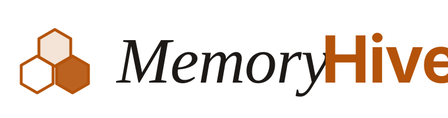

<p align="center">
  <picture>
    <source media="(prefers-color-scheme: dark)" srcset="assets/logo-dark.svg">
    
  </picture>
</p>

<p align="center">
  <em>Shared, continuously learning memory for every agent, model, IDE, and harness.</em>
</p>

<p align="center">
  <a href="LICENSE"></a>
  <a href="https://github.com/TJCurnutte/memory-hive/actions/workflows/ci.yml"></a>
  <a href="https://github.com/TJCurnutte/memory-hive/releases/latest"></a>
  
  <a href="https://memoryhive.neural-forge.io"></a>
</p>

---

## What it is

Memory Hive is a **local, file-backed memory layer** that works with any AI agent, model, IDE, or harness. It gives every agent a private silo and a shared hive, so tasks compound instead of starting from scratch.

No daemon. No account. No vendor lock-in.

## Install

```bash
curl -fsSL https://memoryhive.neural-forge.io/install.sh | sh
```

The installer creates `~/.memory-hive`, sets up the shared hive, and wires lightweight boot blocks into the agent platforms it finds on your machine.

## Three commands

Memory Hive v3 is built around three verbs:

```bash
memory-hive do "<task>"              # start work: optimize, recall, route skills, plan
memory-hive done --agent <name>      # finish work: log + optional learning
memory-hive status                   # see if the hive is healthy (fast)
```

Everything else still exists under the hood, but you rarely need it.

## Universal by design

Memory Hive is intentionally **agnostic**:

- **Any model** — the CLI returns plain text and JSON, so any LLM can call it.
- **Any IDE** — boot blocks are one-line hooks that call `memory-hive`. The full contract lives in the CLI, not in your editor config.
- **Any harness** — skills are markdown files, memory is markdown, the index is SQLite, and the transport is the filesystem.
- **Any OS** — POSIX shell + Python 3. No compiled extensions.

Works with Claude Code, Cursor, Codex, Windsurf, Devin, Hermes, aider, Continue, Goose, and anything else that can read files or run a shell command.

## /cohort — 25-agent swarm

For large tasks, run a 25-agent cohort:

```bash
memory-hive cohort "<task>" --agent <name>
```

It emits a ready-to-run plan with 25 specialist roles (planner, code, review, research, docs, QA, security, integration, release, etc.). The host IDE fans them out with its own subagent primitives — Devin `run_subagent`, Claude Tasks, Cursor Composer, and so on — so it stays portable.

## How it works

```
~/.memory-hive/
├── hive/
│   ├── agents/<name>/      # private silos (log, memory, context)
│   ├── learnings/raw/      # raw per-agent lessons
│   ├── learnings/distilled/# promoted shared lessons
│   ├── knowledge/          # shared facts and human context
│   └── .hivecode/          # auto-built SQLite index
├── memory-hive             # the CLI
├── memory_hive_orchestrate.py
├── memory_hive_recall.py
└── templates/skills/       # IDE-agnostic skill templates
```

The loop is simple:

1. **Read** — agents hydrate from the shared hive + their private silo.
2. **Work** — `memory-hive do` optimizes the prompt, runs HyperRecall, matches skills, and builds a plan.
3. **Write** — `memory-hive done` logs the work and writes reusable learnings.
4. **Curate** — the `main` curator promotes verified lessons into shared knowledge.

## Quick start

```bash
# 1. Install
curl -fsSL https://memoryhive.neural-forge.io/install.sh | sh

# 2. Add an agent
memory-hive add coder --role coder

# 3. Start work
memory-hive do "refactor the auth module" --agent coder

# 4. Run a 25-agent cohort
memory-hive cohort "ship auth v2" --agent coder

# 5. Finish work
memory-hive done --agent coder --log "refactored auth" --learn "Always hash passwords with Argon2id."
```

## Why this is different

- **No bloated boot blocks** — v3 moves the contract out of your IDE settings and into the CLI. One line per IDE, one source of truth.
- **Fast status** — `memory-hive status` is instant; run `memory-hive status --full` for a deeper check.
- **Structured prompt optimization** — `memory-hive do` preserves GOAL, CONSTRAINTS, SUCCESS CRITERIA, OUTPUT, and code examples instead of stripping them.
- **Cohort-first** — `/cohort` gives you a full implementation team without tying you to a single platform's swarm feature.

## License

MIT — see [LICENSE](LICENSE).
